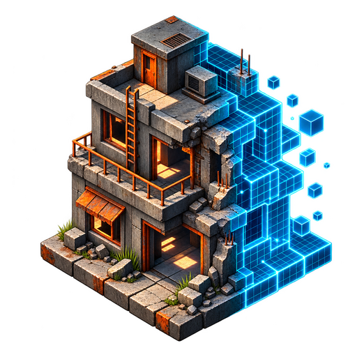
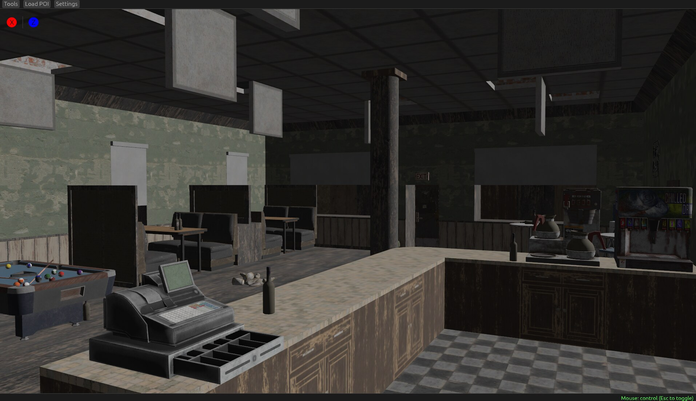

# SuperDummy — 7DTD POI Viewer

### An unofficial, fan-made 3D POI viewer for 7 Days to Die

Explore prefabs and points of interest outside the game with a free-fly camera and configurable real-time rendering.

**[Download the latest release](https://github.com/xvgray/superdummy-releases/releases/latest)** · [Report an issue](https://github.com/xvgray/superdummy-releases/issues) · [Support development](https://buymeacoffee.com/bullrider)

> **Unofficial project:** SuperDummy — 7DTD POI Viewer is an independent, fan-made tool. It is not affiliated with, endorsed by or supported by The Fun Pimps.

---

## What is SuperDummy?

**SuperDummy — 7DTD POI Viewer** (short name: **SuperDummy**) is a standalone desktop viewer for prefabs and points of interest (POIs) from **7 Days to Die**. It reads compatible data and assets from your existing game installation and builds an interactive 3D scene, making it easier to inspect buildings, block placement and prefab details without loading a game world.

The application is written in **Rust**, built with **Bevy** and **bevy_egui**, and uses Vulkan rendering on Windows.

## Features

- Explore 7 Days to Die POIs in an interactive 3D view
- Navigate freely with a fly camera
- Automatically center the camera on a loaded prefab
- Build geometry from block and prefab data
- Display block models from the game installation
- Configure grid, fog and lighting
- Choose rendering-quality settings
- Adjust bloom and tone mapping
- Save application preferences
- Read compatible XML, `.blocks.nim` and `.tts` data

## Requirements

- **Windows 10 or Windows 11**, 64-bit
- A Vulkan-capable graphics card with current drivers
- A legally obtained, compatible installation of **7 Days to Die**
- Enough free disk space for the application and temporary asset data

> Game files and assets are not included with SuperDummy.

## Installation

A public build is not available yet. The first Windows package will appear on the [Releases](https://github.com/xvgray/superdummy-releases/releases) page.

When a build is published:

1. Download the ZIP archive attached to the newest release.
2. Extract it to a writable directory.
3. Run `superdummy.exe`.
4. Choose **Load POI...** and select the required POI or game data when prompted.

Windows SmartScreen may warn about unsigned early builds. Always verify that the archive was downloaded directly from this repository.

## Project status

SuperDummy is under active development. Early releases may contain missing models, fallback geometry, visual differences or compatibility issues after a 7 Days to Die update.

The source code is maintained in a separate private repository. This repository is the official home for public documentation, Windows downloads and release notes.

## Screenshot

*An in-development build of SuperDummy displaying the interior of a 7 Days to Die POI.*

## Feedback and bug reports

Suggestions and bug reports are welcome through [GitHub Issues](https://github.com/xvgray/superdummy-releases/issues).

For rendering or loading problems, please include:

- SuperDummy version
- 7 Days to Die version
- Windows version
- Graphics card model
- Name of the affected POI
- A screenshot and the relevant part of the application log, if available

Please do not attach copyrighted game assets.

## Support the project

If SuperDummy is useful to you and you would like to support its development:

Every contribution helps with development, testing and future features. Thank you!

## Disclaimer

SuperDummy — 7DTD POI Viewer is an independent, unofficial fan-made tool. It is not affiliated with, endorsed by or supported by The Fun Pimps or the developers and publishers of 7 Days to Die.

7 Days to Die and related names, trademarks and game assets belong to their respective owners. SuperDummy does not distribute game assets and requires users to provide their own compatible game installation.

## Distribution

Unless a specific release states otherwise, no license is granted to modify, redistribute or commercially use the application binaries without the author's written permission.

---

Made with Rust and Bevy

