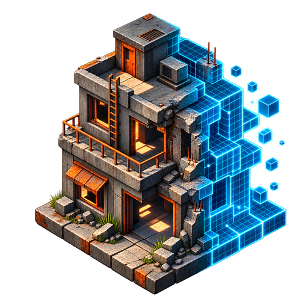
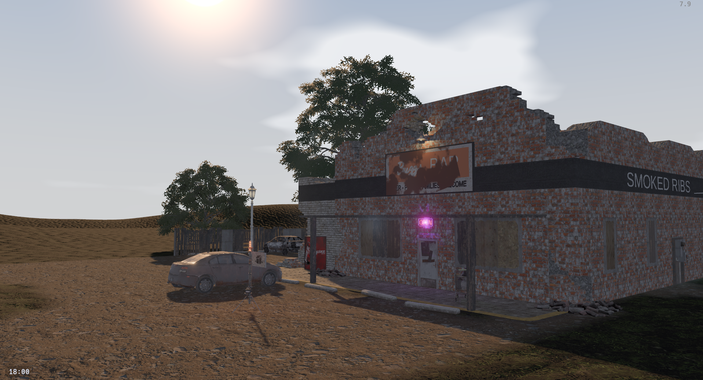
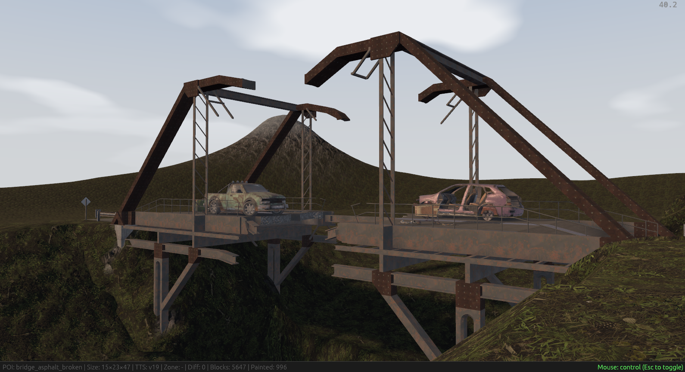
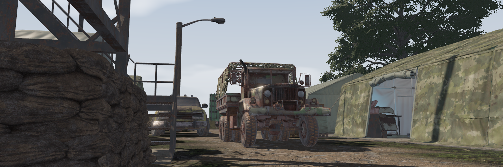
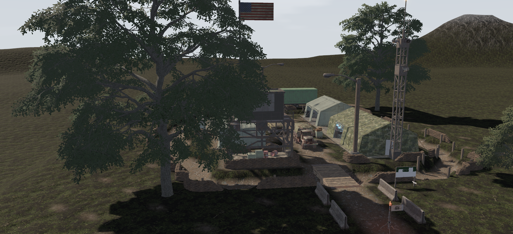

# SuperDummy

**0.1.0 — Water Edition · First stable release**

A free, standalone viewer and inspection tool for **7 Days to Die** prefabs.

View prefabs without launching a game world, analyse POI data and sleeper volumes, and present your own prefabs.

[Release notes](https://github.com/xvgray/superdummy-releases/releases/tag/v0.1.0) · [What can you do with SuperDummy?](#what-can-you-do-with-superdummy) · [Report an issue](https://github.com/xvgray/superdummy-releases/issues) · [Support development](https://buymeacoffee.com/bullrider)

**Windows 10/11, 64-bit · Requires your own 7 Days to Die installation · No game assets included**

---

## Screenshots

*Screenshots from **0.1.0-pre.3**, an earlier build — they do not show the Water Edition improvements.*

<table>
  <tr>
    <td></td>
    <td></td>
  </tr>
  <tr>
    <td></td>
    <td></td>
  </tr>
</table>

*More scenes rendered by SuperDummy v0.1.0-pre.3.*

---

## What can you do with SuperDummy?

- **Browse game and local prefabs** — open the POIs shipped with your game (`Data\Prefabs\POIs`) or compatible local `.tts` prefabs from a folder you choose.
- **Inspect interiors freely** — fly the camera anywhere to examine geometry, block placement and models.
- **Read POI statistics** — a report of the loaded prefab (size, block counts, missing data) with **TXT/CSV export**.
- **Study sleepers and spawn volumes** — a sleeper panel lists volumes, weights and spawn markers, with volume outlines and previews shown in the scene.
- **Present your builds** — cinematic orbit (**Cinema orbit**), time-of-day changes and **tilt-shift**.
- **Save local prefab thumbnails** — a clean 280 × 210 JPEG preview next to your local prefab.

SuperDummy is an inspection and presentation tool, not a game client — it does not simulate spawning, AI or physics.

## What's new in 0.1.0 — Water Edition

0.1.0 is the first stable release. Water Edition adds animated water surfaces and refraction, a **LOCAL PREFABS** mode for your own prefabs, prefab thumbnails, a cinematic orbit camera with tilt-shift, and improved POI and sleeper statistics.

[Read the full 0.1.0 release notes](https://github.com/xvgray/superdummy-releases/releases/tag/v0.1.0) · [Earlier releases (changelog)](CHANGELOG.md)

## Installation and first run

1. Download **[SuperDummy 0.1.0 for Windows x64](https://github.com/xvgray/superdummy-releases/releases/download/v0.1.0/SuperDummy-0.1.0-water-edition-windows-x64.zip)** and extract the **entire ZIP**.
2. Keep the `assets` and `resources` folders beside `superdummy.exe`.
3. Run `superdummy.exe`. SuperDummy tries to find your game installation; select the game folder if prompted.
4. Open **Load POI** and choose **GAME PREFABS** or **LOCAL PREFABS**.

The default local prefab folder is `%APPDATA%\7DaysToDie\LocalPrefabs`; you can choose another folder in the browser. Settings, logs and caches are stored in `%LOCALAPPDATA%\SuperDummy` (preferences in `settings.xml`).

> **Download the named Windows ZIP, not GitHub's automatic “Source code” archives.** This repository contains public release documentation, not the application source.

## Requirements, compatibility and limitations

**Requirements**

- **Windows 10/11, 64-bit**, with a Vulkan-capable GPU and current drivers.
- **8 GB RAM minimum; 16 GB recommended.**
- Your own, compatible installation of **7 Days to Die**. Game files and assets are not included.

**Tested with 7 Days to Die V 3.2.0 (b10), Steam build 24994517.** Other versions have not been confirmed; detecting an installation does not guarantee compatibility with every version.

**Limitations**

- Local prefabs are based on the base game's blocks. Blocks and assets added by mods are **not fully supported**; a mod-dependent prefab may render with missing parts.
- SuperDummy does not simulate AI, physics or actual spawn behaviour. Sleeper data is an inspection aid, not a prediction of what the game will spawn.
- Water is a **visual approximation**, not a fluid simulation.
- **Scenic Terrain** is a presentation background, not an exportable game world.
- **Cinema orbit** controls the camera only; recording a video requires an external screen recorder.
- Thumbnails are **280 × 210 JPEG** images and are available for **local prefabs** only.
- Higher lamp shadow limits and tilt-shift can reduce the frame rate. The depth prepass option is experimental and requires a restart.

## Feedback, bugs and ideas

Suggestions and bug reports are welcome through [GitHub Issues](https://github.com/xvgray/superdummy-releases/issues).

Please include:

- the **name of the affected prefab or POI**,
- your **SuperDummy version** and **7 Days to Die version**.

For technical problems, also add:

- your **Windows version** and **graphics card**,
- a **screenshot** and the relevant part of the application **log**.

Please **do not upload or attach game assets**.

If SuperDummy saved you time, a ⭐ on the repository is a simple way to say thanks.

## Project status

0.1.0 is the **first stable release**, and the project is **still under active development**. “Stable” means a complete, tested release — not full compatibility with every game asset or version.

The source code is maintained in a separate private repository. This repository is the official home for public documentation, Windows downloads and release notes.

## Support the project

If SuperDummy is useful to you, you can support its development:

Every contribution helps with development, testing and future features. Thank you!

## License — Freeware

SuperDummy is distributed as freeware for personal or commercial use, subject to the license terms. See the full **[SuperDummy Freeware License](LICENSE.md)**.

## Disclaimer

SuperDummy is an independent, unofficial fan-made tool. It is not affiliated with, endorsed by or supported by The Fun Pimps or the developers and publishers of 7 Days to Die. 7 Days to Die and related names, trademarks and game assets belong to their respective owners. SuperDummy does not distribute game assets and requires users to provide their own compatible installation.

---

Made with Rust and Bevy

